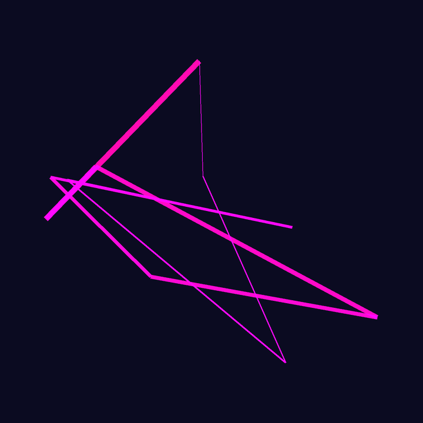
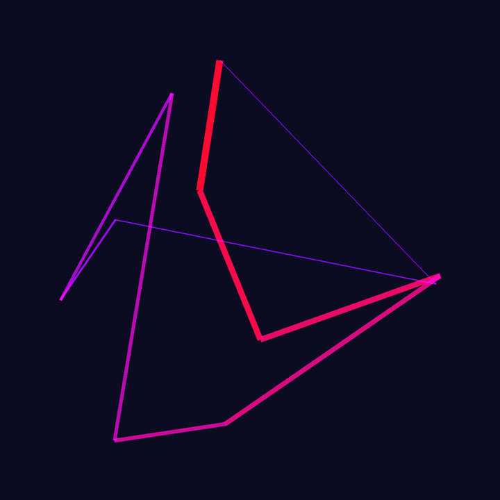
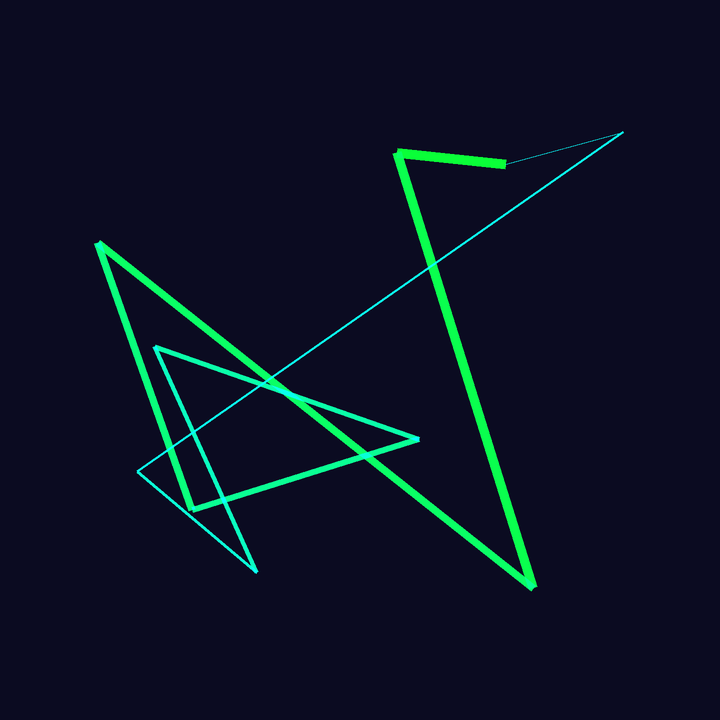

# Generative Art

A simple Art/NFT generator, that uses the [Pillow](https://pypi.org/project/Pillow/) library

## Usage

Just run the file and you will get 15 completely new Images generated.

## Config
You can change the image size, padding, and number of images in the  file.
Example file:
```
number_images = 15
image_size = 720
image_padding = 90
```

Example Images:




